# PROJECT BANKING SYSTEM
 

## Deskripsi
Project Banking System ini dibuat untuk memenuhi tugas proyek Ujian Tengah Semester (UTS) mata kuliah Prak. Pemrograman Berorientasi Objek (PBO), pada semester 4 bulan Mei tahun 2024. Proyek ini dibuat menggunakan bahasa pemrograman Java, menggunakan konsep Object Oriented Programming (OOP) dalam penulisan kodenya dan tampilan output akhir akan berupa Command Line Interface (CLI).
   

## Creator
**Delon Grace Famohouni Nazara** 
**NIM 221401073** 
**Lab 4 PBO** 
  

## Tampilan Program
 Tampilan saat program pertama kali dijalankan akan terlihat seperti ini:  
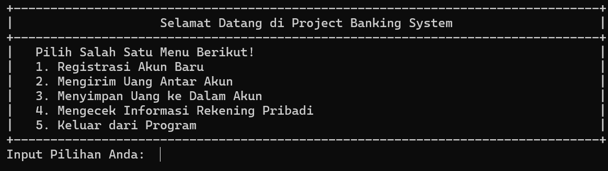

 Ketika user memilih menu 1 (Registrasi Akun Baru), maka akan muncul tampilan inputan yang meminta informasi yang dibutuhkan untuk mendaftarkan akun baru:  
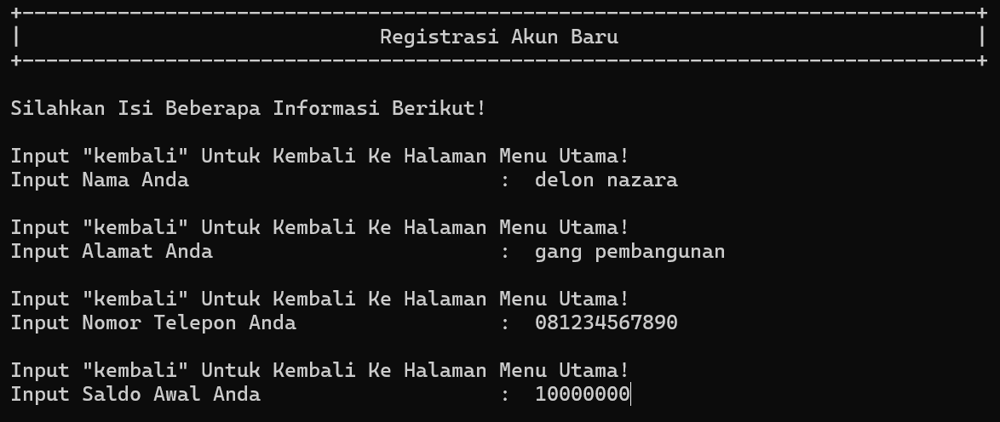

 Ketika user selesai menginput, maka akan muncul tampilan konfirmasi yang menampilkan inputan user sebelumnya:  
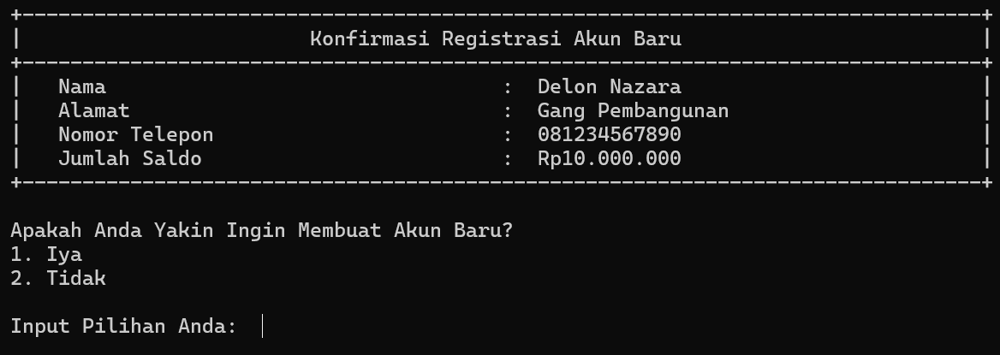

 Ketika user mengkonfirmasi, maka akun akan dibuat dan informasi akun tersebut ditampilkan:  
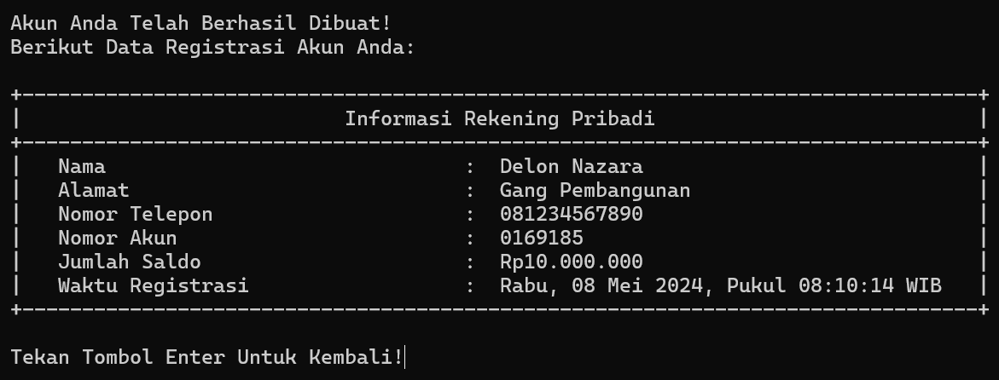

 Menu lainnya yang tersedia adalah menu 2 (Mengirim Uang Antar Akun):  
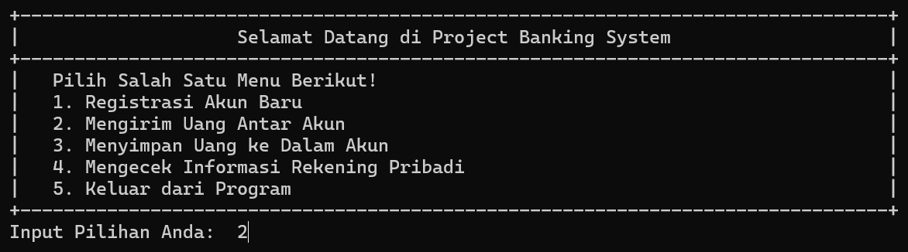

 Akan tetapi, proses pengiriman uang antar akun membutuhkan 2 akun. Untuk itu, akun kedua dibuat terlebih dahulu:  
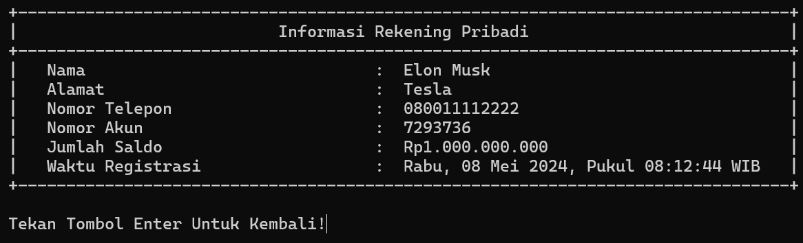

 Ketika user memilih menu 2, maka akan muncul tampilan inputan yang meminta informasi yang dibutuhkan untuk mengirim uang:  
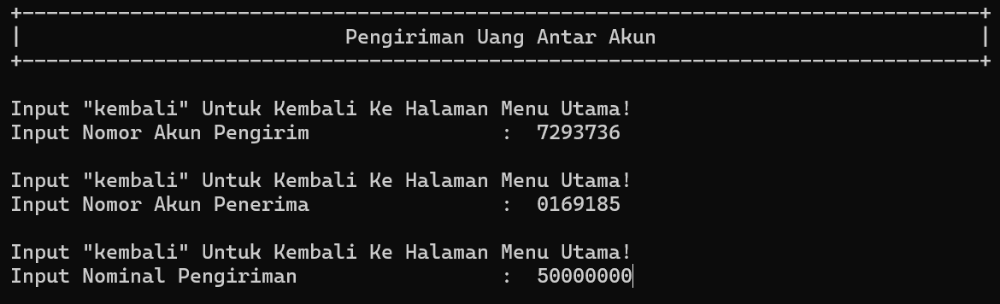

 Ketika user selesai menginput, maka akan muncul tampilan konfirmasi yang menampilkan inputan user sebelumnya:  
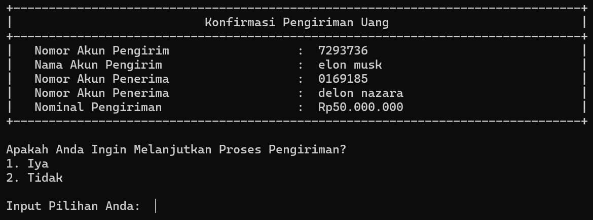

 Ketika user mengkonfirmasi, maka pengiriman uang akan diproses dan informasi pengiriman ditampilkan:  
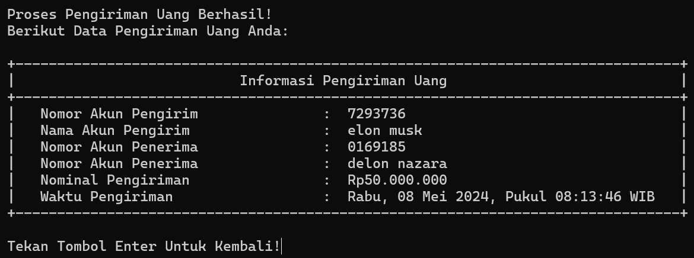

 Untuk memastikan bahwa proses pengiriman berhasil, pilih menu 4 (Mengecek Informasi Rekening Pribadi):  

 Ketika user memilih menu 4, kemudian menginput nomor akun yang ingin dicek, maka akan ditampilkan informasi akun tersebut:  
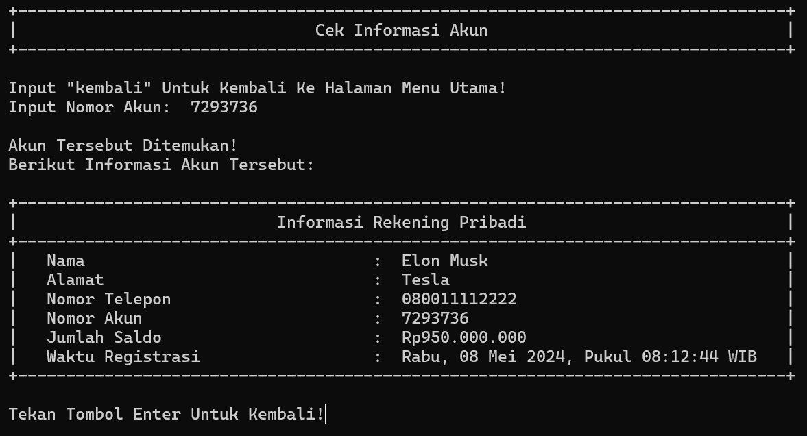  
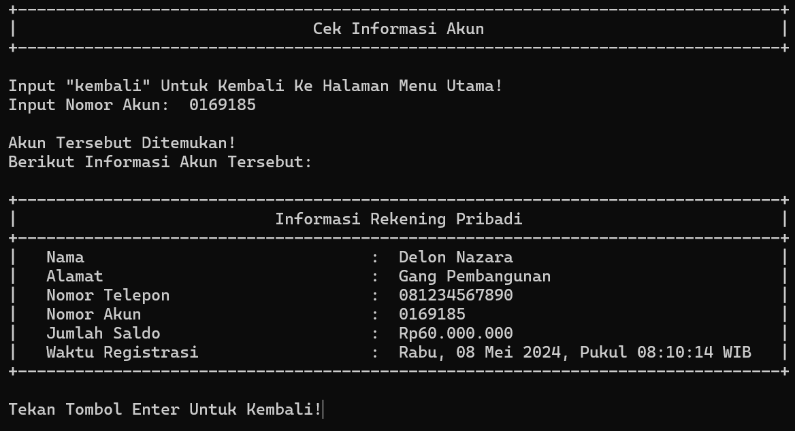

 Menu selanjutnya yang tersedia adalah menu 3 (Menyimpan Uang ke Dalam Akun):  
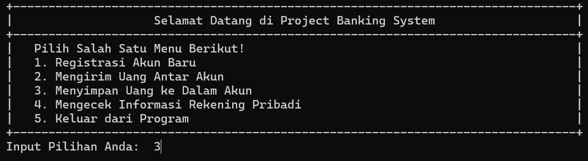

 Ketika user memilih menu 3, maka akan muncul tampilan inputan yang meminta informasi yang dibutuhkan untuk menyimpan uang:  
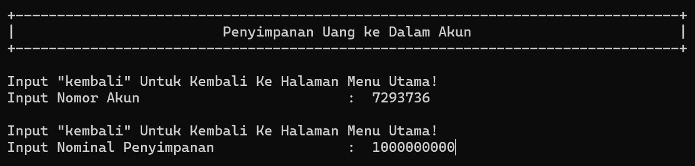

 Ketika user selesai menginput, maka akan muncul tampilan konfirmasi yang menampilkan inputan user sebelumnya:  
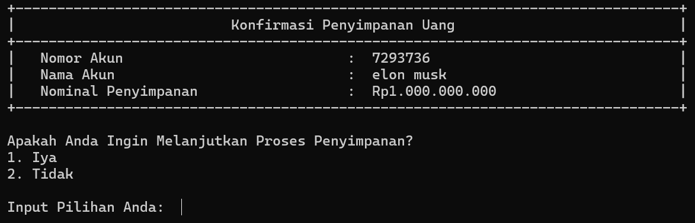

 Ketika user mengkonfirmasi, maka penyimpanan uang akan diproses dan informasi penyimpanan ditampilkan:  
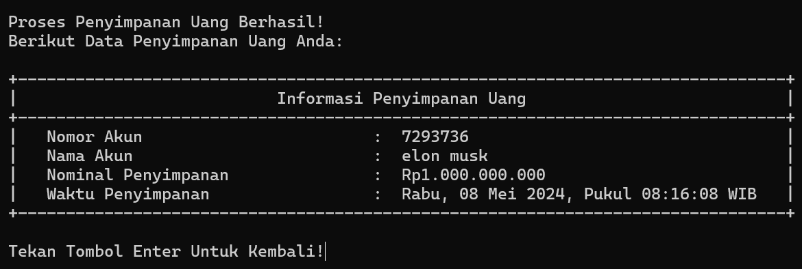

 Untuk memastikan bahwa proses penyimpanan berhasil, pilih menu 4 dan input nomor akun pada proses sebelumnya:  
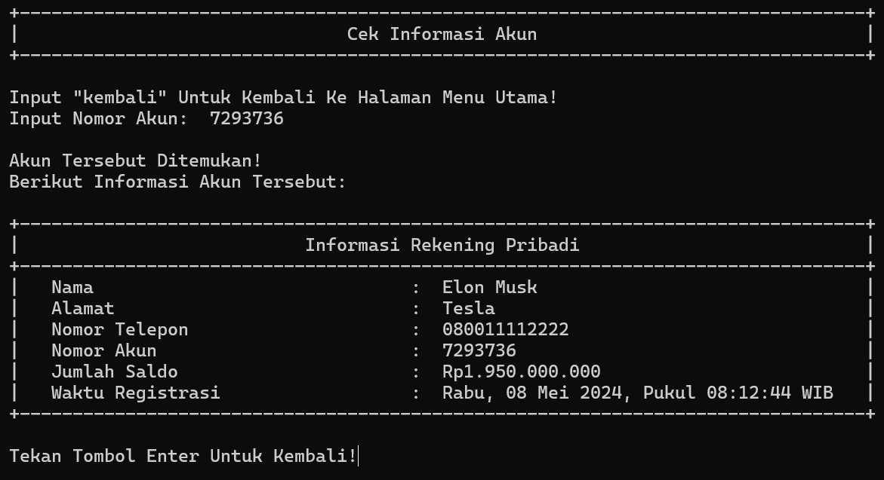

 Menu terakhir adalah menu 5 (Keluar dari Program):  
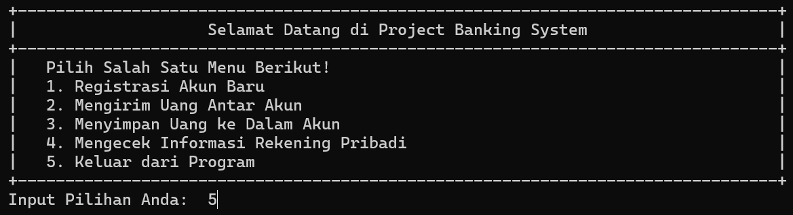

 Ketika user memilih menu 5, maka akan muncul tampilan seperti ini:  
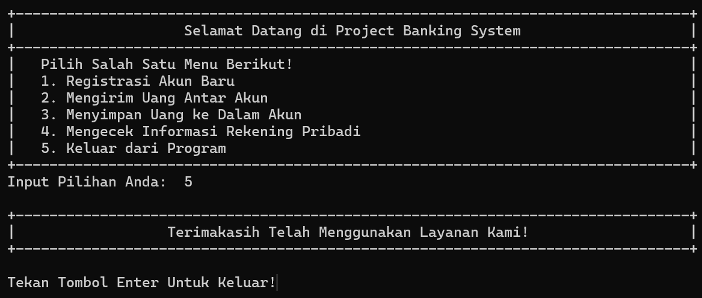
